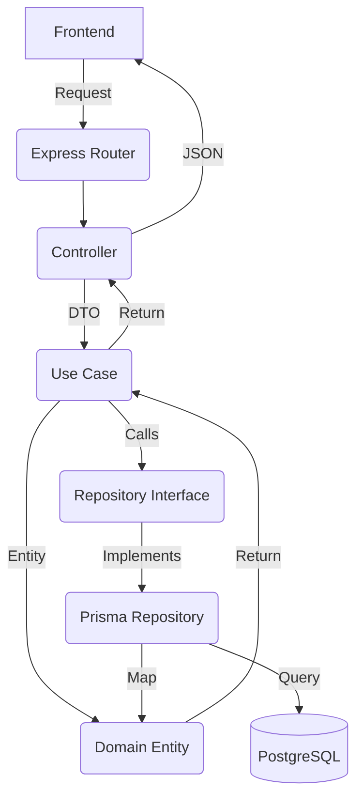

# Request Workflows

This document explains the technical "journey" of a request through the RentEase Server's layers.

## 🔄 The Standard Flow

When a frontend request hits the server, it follows this path:

1.  **App Start**: `Container_Setup.registerAll()` runs, and `tsyringe` registers all dependencies (e.g., `IUserRepository` -> `UserRepository`).
2.  **HTTP Request**: Hits an Express route (e.g., `POST /api/users/register`).
3.  **Routing**: `user.routes.ts` directs the request to the `UserRegisterController.register` method.
4.  **Dependency Injection**: `tsyringe` resolves the controller, which requires a `Use Case`. The Use Case in turn requires a `Repository`, `HashService`, etc. All are injected automatically.
5.  **Controller**:
    -   Extracts data from `req.body`.
    -   Calls `useCase.execute(dto)`.
6.  **Use Case**:
    -   Orchestrates business logic.
    -   Calls `UserMapper.toEntity(dto)` to convert raw data to a Domain Entity.
    -   Interacts with the `Repository`.
7.  **Repository Interface**: The Use Case calls a method on the interface (e.g., `iUserRepository.create`).
8.  **Repository Implementation**: The actual `UserRepository` (infrastructure layer) runs the Prisma/PostgreSQL query.
9.  **Persistence Mapper**: Converts the database record back into a clean Domain Entity.
10. **Response**: The entity bubbles back up to the Controller, which returns a JSON response: `{ success: true, data: user }`.

## 📦 Container Setup & DI

We use `tsyringe` for Dependency Injection. This allows us to:
-   Easily swap implementations (e.g., swapping a production DB for a mock DB).
-   Decouple high-level logic from low-level infrastructure.
-   Maintain clean constructors and clear dependency graphs.

## 🛠 Flow Diagram

